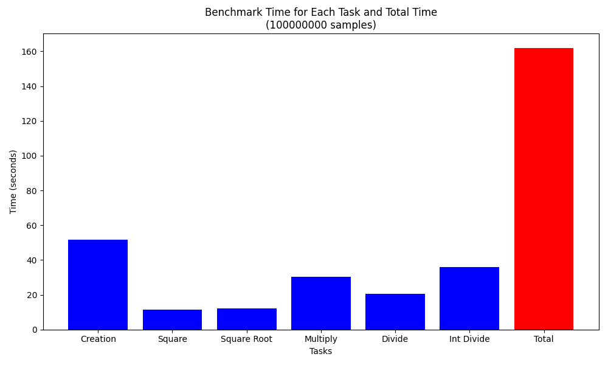

# data-science-benchmarks
Benchmark your copmputer with common tasks in Data Science to stress it. This project started inspired by [djcunningham0](https://github.com/djcunningham0/m1_benchmarks)'s nice work of creating some code to benchmark M1 Macbooks. What I've done was to reorganize the project to be more agnostic, with a simple interface for users to run these benchmarks. See below for instructions and images.

# Setup

For lightgbm task, it's better to install throught homebrew (install `libomp` dependency as well with homebrew)
```
brew install lightgbm
```

# Tasks
Every task generate some cool graphs and a csv with the result data. Default value for the size of data being processed is quite large, to stress the computer for this estimate. Images provided below are from a MacBook Pro i7 with 16GB RAM.
## CPU and Memory Tasks

### Pure Python task
Several operations on a big list with pure python.


### ML Training Task
Simple training example with larget dataset and LGBM.



### Pandas Task
Some large joins in pandas. Still working on this but an example is on `cpu_and_memory_tasks/pandas/benchmark_pandas.py`.

### TODOs

[ ] Linear Algebra example with numpy
[ ] Training example with GPU

I thought about dockerizing everything, but the idea of the project is to give a sense of how your computer will behave in a normal day, and usually data scientists interact with data through jupyter notebooks at most in virtual environments, but not inside docker containers.